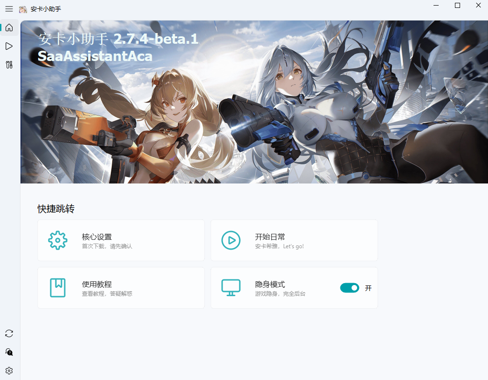
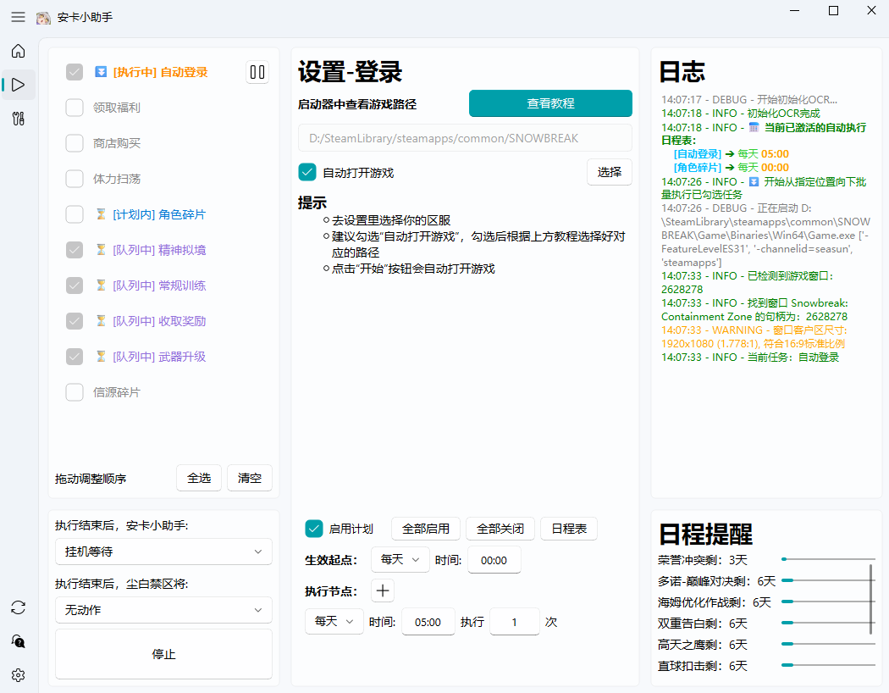
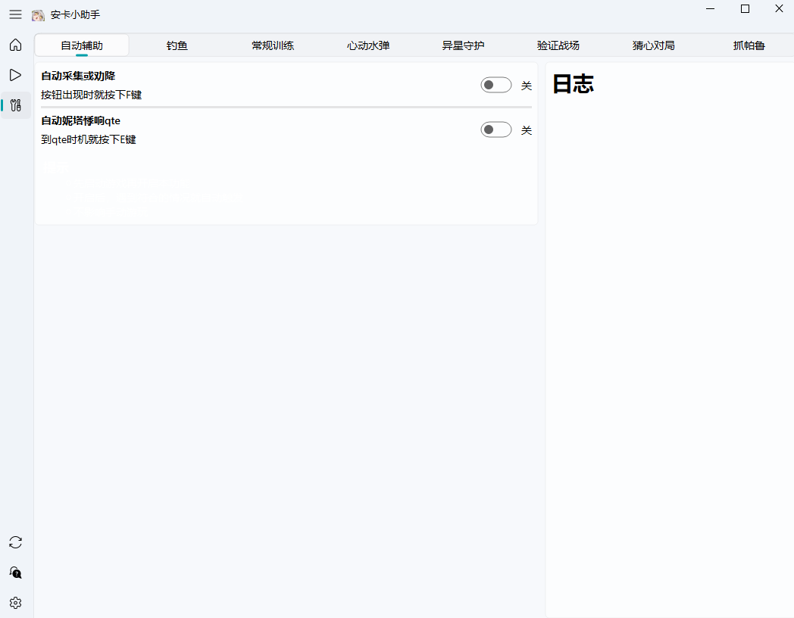
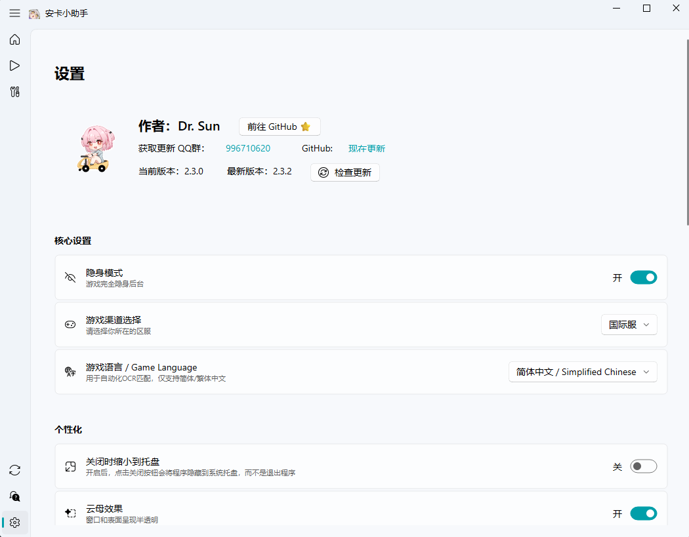

  <h1>
    
     
    SaaAssistantAca
  </h1>

  <a href="https://github.com/mofaoss/SaaAssistantAca" target="_blank">
    <b style="color: #ff9800;">Star before you leave~</b>
    
  </a>

   

  English | <a href="../README.md">简体中文</a>

  

## ✨Feature Introduction
> [!Tip]
> **Update**
> 1. **Stealth Mode** is now available, allowing the game to run completely hidden in the background
> 2. SaaAssistantAca is now fully refactored, installer size reduced by 25%, better compatibility, faster speed, and a more concise UI
> 3. Added **custom task lists and scheduled/periodic execution**
> 4. Added support for Traditional Chinese and English, including Traditional Chinese game client
> 5. Added regular logistics farming, Star Exploration Pal Capture, and more new features
> 6. Enhanced OCR accuracy, fixed Steam login, stamina potion day recognition; optimized memory shard usage; removed windowed mode restriction

> [!Warning]
>
> 1. Only supports 16:9 game aspect ratio, both fullscreen and windowed. Resolution should be at least 1280×720, higher is better
> 2. Game language must be Simplified or Traditional Chinese

### ✨Feature List

👉 Click to view progress 👈

✅ Game login

✅ Daily rewards: mail, friend stamina, supply station stamina, bait, dorm puzzles

✅ Shop purchases

✅ Event material farming

✅ Daily character fragments

✅ Neural Simulation sweep

✅ Daily mission reward collection

✅ Auto-fishing (background)

✅ Psychube analysis solution calculation

✅ Weekly 20-stage challenge

✅ Heartbeat Water Balloon

✅ Verification Battlefield (new maze)

✅ Extraterrestrial Guardian (endless & breakthrough)

✅ Mind Game

✅ Nita E-skill auto-QTE

✅ Light/dark mode adaptation

✅ Auto-collection assist

✅ Automatic coordinate and schedule reminder updates

✅ Direct game launch via SAA

✅ GPU acceleration for NVIDIA/AMD

✅ Auto-start on boot

✅ Stamina recovery notifications

✅ Auto redeem codes

✅ Regular logistics farming

✅ Star Exploration Pal Capture

⬜ Massage

⬜ Update log display

⬜ Global hotkeys

⬜ Auto-gacha

### ⚡Usage & Documentation
> [!Important]
>
> SAA documentation: https://saadocs.netlify.app/ (partly outdated)

### ✨Running

👉 Click to expand screenshots 👈

  
  
  
  

### 📌Download
- [Github Release](https://github.com/mofaoss/SaaAssistantAca/releases)

## ❤️Related Projects
- Tribute to upstream: https://github.com/LaoZhuJackson/SnowbreakAutoAssistant

## 📝License
> [!Note]
>
> GPLv3 License
[LICENSE](https://github.com/mofaoss/SaaAssistantAca/blob/main/LICENSE)
