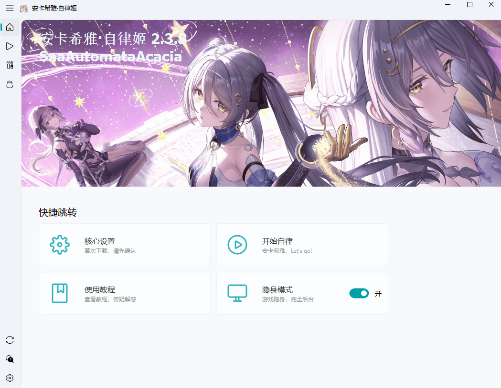
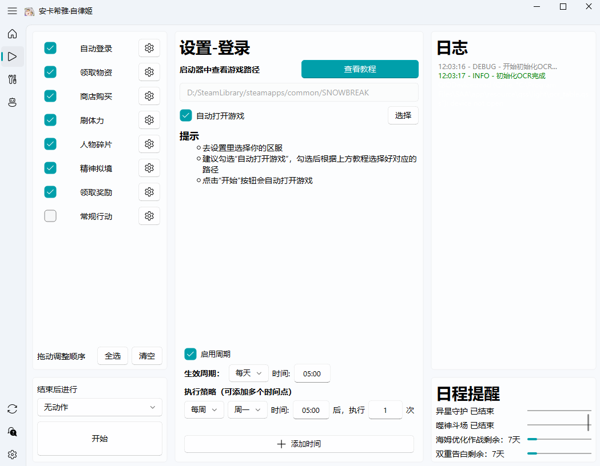
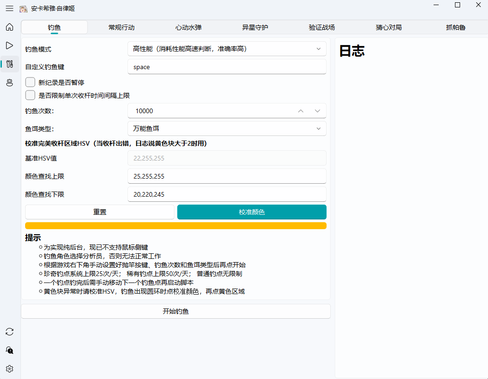
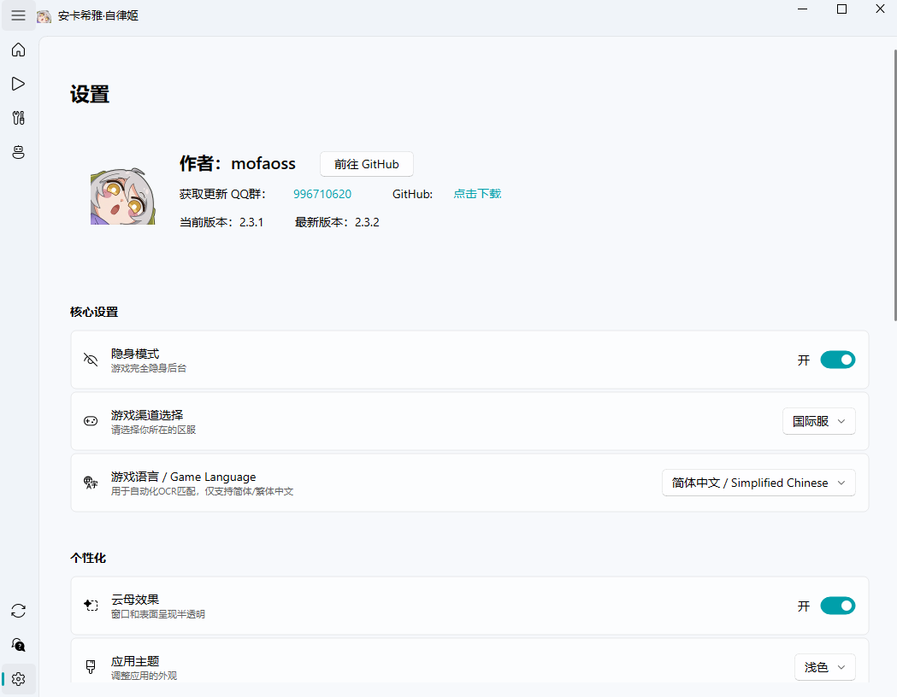

    <h1>
        
         
        SaaAutomataAcacia
    </h1>
     

<a href="../README.md">简体中文</a> | English

## ✨Feature Introduction

> [!Tip]
> **Update**
> 1. **Stealth Mode**, allowing the game to run completely hidden in the background
> 2. **Automata Acacia** now has a **fully redesigned UI**
> 3. Added **custom task lists** and **periodic/scheduled execution** features
> 4. Added support for **Traditional Chinese and English**, including compatibility with Traditional Chinese game clients
> 5. Added **standard logistics** and **Pals capturing** functions
> 6. Enhanced OCR accuracy; fixed Steam login issues and stamina potion duration recognition; optimized memory shard usage; **removed the windowed‑mode restriction**

> [!Warning]
>
> 1. Currently supports only 16:9 game aspect ratios, with both fullscreen and windowed modes. A resolution of at least 1280×720 is recommended. The higher the resolution, the better.
> 2. Game language must be simplified/traditional chinese.

### ✨Feature List

Click to view development progress

✅ Game login

✅ Daily resource collection: Mail, friend stamina, supply station stamina, bait, dorm puzzles

✅ Shop purchases

✅ Event material farming

✅ Daily character fragments

✅ Neural Simulation sweep

✅ Daily mission reward collection

✅ Auto-fishing (pure background)

✅ Psychube analysis solution calculation

✅ Weekly 20-stage challenge

✅ Heartbeat Water Balloon

✅ Verification Battlefield (new maze)

✅ Extraterrestrial Guardian (endless & breakthrough)

✅ Mind Game

✅ Nita E-skill auto-QTE

✅ Light/dark mode adaptation

✅ Auto-collection trigger

✅ Auto-scaling ratio execution

✅ Automatic coordinate updates & schedule reminders

✅ Direct game launch via SaaAutomataAcacia

✅ GPU acceleration support for NVIDIA/AMD

✅ Auto-start on boot

✅ Stamina recovery notifications

✅ Auto redeem codes

✅ Farm operation logistics

✅ Star Exploration Pal Capture

⬜ Massage therapy

⬜ Update log display

⬜ Global hotkeys

⬜ Auto-gacha

### ⚡ Usage & Documentation

> [!Important]
>
> SaaAutomataAcacia Documentation: https://saadocs.netlify.app/ (Partly outdated)

### ✨ Running

👉 Click to expand screenshots 👈

  
  
  
  

### 📌Download

- [Github Release](https://github.com/mofaoss/SaaAutomataAcacia/releases)

## ❤️ Related Projects

- Thanks for upstream: https://github.com/LaoZhuJackson/SnowbreakAutoAssistant

## 📝License

> [!Note]
>
> GPLv3 License
[LICENSE](https://github.com/mofaoss/SaaAutomataAcacia/blob/main/LICENSE)
